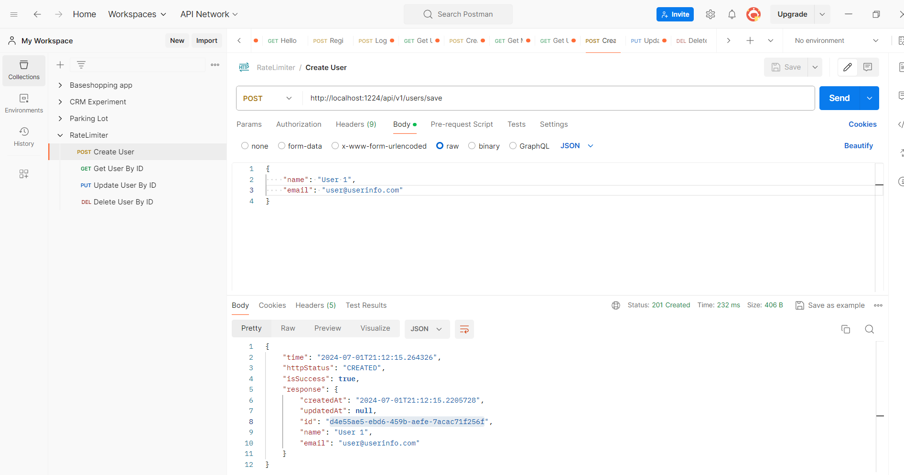

# RATE LIMITER WITH REDIS

<p align="center">
    
</p>

### 📖 Information

<ul style="list-style-type:disc">
  <li>This application is a <b>Spring Boot application</b> demonstrating rate limiting with Redis for user management operations.</li>
  <li>
    <b>Explanation:</b>
    <ul>
      <li><b>UserController:</b> The API endpoint for managing user information. It includes methods to handle creating, retrieving, updating, and deleting user data. This controller interacts with the UserService to perform these operations.</li>
      <li><b>UserService:</b> Contains the business logic for user management. It performs CRUD operations on the User entity and interacts with the RateLimiterService to apply rate limiting rules.</li>
      <li><b>RateLimiterService:</b> Utilizes Redis to track and enforce rate limiting rules. It ensures that the number of requests made by a user does not exceed the specified limit within a given time window.</li>
      <li><b>UserRepository:</b> Extends Spring Data JPA's JpaRepository, providing methods for performing database operations on user entities. This layer abstracts the data access operations, making it easier to manage user data.</li>
      <li><b>Redis Configuration:</b> Redis is configured to support rate limiting functionality. The configuration includes setting up a RedisTemplate for efficient data access and operations. This template handles the interactions with Redis, such as incrementing request counts and setting expiration times for keys, ensuring accurate rate limiting.</li>
      <li><b>Validation:</b> The application uses Hibernate Validator for validating user input. This ensures that the data passed to the API endpoints is in the correct format and adheres to the defined constraints.</li>
      <li><b>Exception Handling:</b> Custom exception handling mechanisms are implemented to manage various error scenarios, such as user not found, email already exists, and rate limit exceeded.</li>
    </ul>
  </li>
</ul>

### Explore Rest APIs

<table style="width:100%">
  <tr>
      <th>Method</th>
      <th>Url</th>
      <th>Description</th>
      <th>Request Body</th>
      <th>Header</th>
      <th>Valid Path Variable</th>
      <th>Request Param</th>
      <th>No Path Variable</th>
  </tr>
  <tr>
      <td>POST</td>
      <td>/api/v1/users/save</td>
      <td>Create a new user</td>
      <td>CreateUserRequest</td>
      <td></td>
      <td></td>
      <td></td>
      <td></td>
  </tr>
  <tr>
      <td>GET</td>
      <td>/api/v1/users/{id}</td>
      <td>Retrieve a user by ID</td>
      <td></td>
      <td></td>
      <td>{id} - Valid UUID</td>
      <td></td>
      <td></td>
  </tr>
  <tr>
      <td>PUT</td>
      <td>/api/v1/users/{id}</td>
      <td>Update an existing user</td>
      <td>UpdateUserRequest</td>
      <td></td>
      <td>{id} - Valid UUID</td>
      <td></td>
      <td></td>
  </tr>
  <tr>
      <td>DELETE</td>
      <td>/api/v1/users/{id}</td>
      <td>Delete a user by ID</td>
      <td></td>
      <td></td>
      <td>{id} - Valid UUID</td>
      <td></td>
      <td></td>
  </tr>
  <tr>
      <td>GET</td>
      <td>/api/v1/users</td>
      <td>Retrieve a paginated list of users</td>
      <td>UserPagingRequest</td>
      <td></td>
      <td></td>
      <td></td>
      <td></td>
  </tr>
</table>


---
### Technologies


- Java 21
- Spring Boot 3.0
- Restful API
- Lombok
- Maven
- Junit5
- Mockito
- Integration Tests
- Docker
- Docker Compose
- CI/CD (Github Actions)
- Postman
- Spring Bean Validation

---
### Postman

```
Import postman collection under postman_collection folder
```

---
### Prerequisites

#### Define Variable in .env file

```
DATABASE_USERNAME={DATABASE_USERNAME}
DATABASE_PASSWORD={DATABASE_PASSWORD}
```

---
- Maven or Docker
---


### Docker Run
The application can be built and run by the `Docker` engine. The `Dockerfile` has multistage build, so you do not need to build and run separately.

Please follow directions shown below in order to build and run the application with Docker Compose file;

```sh
$ cd ratelimiter
$ docker-compose up -d
```

If you change anything in the project and run it on Docker, you can also use this command shown below

```sh
$ cd ratelimiter
$ docker-compose up --build
```

---
### Maven Run
To build and run the application with `Maven`, please follow the directions shown below;

```sh
$ cd ratelimiter
$ docker run --name redis -p 6379:6379 -d redis
$ mvn clean install
$ mvn spring-boot:run
```

---
### Docker Image Location

```
https://hub.docker.com/repository/docker/noyandocker/ratelimiter/general
```

---
### Screenshots

<details>
<summary>Click here to show the screenshots of project</summary>
    <p> Figure 1 </p>
    
    <p> Figure 2 </p>
    
    <p> Figure 3 </p>
    
    <p> Figure 4 </p>
    
    <p> Figure 5 </p>
    
    <p> Figure 6 </p>
    
    <p> Figure 7 </p>
    
    <p> Figure 8 </p>
    
</details>

### Contributors

- [Sercan Noyan Germiyanoğlu](https://github.com/Rapter1990)